<div align="center">

# 🌿 GreenPulse 2.0

### Enterprise Air Quality Compliance Monitoring Platform

[](https://github.com/GOKUL-2024-HASH/Green-Pulse-v2/actions/workflows/ci.yml)
[](https://opensource.org/licenses/MIT)
[](https://python.org)
[](https://fastapi.tiangolo.com)
[](https://react.dev)
[](https://docs.docker.com/compose/)
[](https://postgresql.org)

> **Intelligent Monitoring. Immutable Auditing. Regulatory Excellence.**

GreenPulse 2.0 is a production-grade regulatory platform for environmental authorities. It transforms live sensor data from the WAQI network into actionable legal evidence — detecting, classifying, and auditing air-quality violations with absolute integrity.

</div>

---

## ✨ Key Features

| Feature | Description |
|---------|-------------|
| 🔴 **Live Data Ingestion** | Polls the WAQI API every 5 minutes for real-world PM2.5, PM10, NO2, SO2, CO, O3 readings |
| 📊 **Streaming Windows** | Pathway 0.29.1 temporal sliding windows (1hr / 8hr / 24hr) with SQL-backed real-time fallback |
| ⚖️ **NAAQS 2009 Rules** | Three-tier CPCB compliance engine: MONITOR → FLAG → VIOLATION |
| 🔐 **Immutable Audit Chain** | SHA-256 cryptographic hash chain — every record is tamper-proof |
| 👮 **Officer Workflow** | JWT-authenticated intervention panel (escalate, dismiss, report) |
| 📄 **PDF Reports** | Auto-generated HTML/PDF violation reports linked into the audit ledger |
| 🐳 **Fully Dockerized** | 5-container orchestration — up and running in a single command |

---

## 🏗️ System Architecture

```mermaid
graph TD
    subgraph External
        WAQI[🌐 WAQI Air Quality API]
    end

    subgraph Pipeline Container
        SCHED[APScheduler\n5-min poll] -->|fetch_reading| CONNECTOR[WAQI Connector]
        CONNECTOR -->|raw reading| DB_WRITE[Persist to\npollutant_readings]
        DB_WRITE -->|SQL AVG 1hr/8hr/24hr| CLASSIFIER[NAAQS Classifier]
        CONNECTOR -->|push_reading| PATHWAY[Pathway 0.29.1\nStreaming Engine]
    end

    subgraph API Container
        FASTAPI[FastAPI\nPython 3.11]
        AUTH[JWT Auth\n+ RBAC]
        ROUTES[Violations / Stations\n/ Actions / Reports]
    end

    subgraph Data Layer
        PG[(PostgreSQL 15\npollutant_readings\ncompliance_events\naudit_ledger)]
        REDIS[(Redis 7\nCaching)]
    end

    subgraph Dashboard Container
        REACT[React 18\nDashboard]
        CHARTS[Recharts\nTrend Charts]
        MAP[KPI Cards\n+ Violation Table]
    end

    WAQI -->|HTTP| CONNECTOR
    CLASSIFIER -->|INSERT| PG
    PATHWAY -.->|best-effort| CLASSIFIER
    FASTAPI --- AUTH
    FASTAPI --- ROUTES
    ROUTES -->|ORM| PG
    ROUTES -->|cache| REDIS
    REACT -->|/api/*| FASTAPI
    REACT --- CHARTS
    REACT --- MAP
```



---

## 🚀 Quick Start

### Prerequisites
- [Docker Desktop](https://www.docker.com/products/docker-desktop/) ≥ 24.x
- A free [WAQI API token](https://aqicn.org/api/)

### 1. Clone & Configure

```bash
git clone https://github.com/GOKUL-2024-HASH/Green-Pulse-v2.git
cd Green-Pulse-v2
cp .env.example .env
```

Edit `.env` and set:
```env
WAQI_API_TOKEN=your_token_here
SECRET_KEY=your-secret-jwt-key
```

### 2. Build & Launch

```bash
docker compose up --build -d
```

### 3. Apply Database Migrations

```bash
docker compose exec api alembic upgrade head
```

### 4. Access the Dashboard

| URL | Description |
|-----|-------------|
| `http://localhost:3000` | React Dashboard |
| `http://localhost:8000/docs` | Interactive API Docs (Swagger) |

**Default credentials:**
```
Email:    admin@greenpulse.in
Password: admin123
```

---

## 📁 Project Structure

```
Green-Pulse-v2/
├── api/                    # FastAPI backend
│   ├── models/             # SQLAlchemy ORM models
│   ├── routes/             # REST endpoint handlers
│   ├── auth.py             # JWT + RBAC
│   ├── database.py         # SQLAlchemy session factory
│   └── main.py             # FastAPI app + lifespan seeding
│
├── pipeline/               # Data ingestion + classification
│   ├── ingestion/          # WAQI API connector
│   ├── streaming/          # Pathway 0.29.1 streaming engine
│   ├── classification/     # NAAQS 2009 rules engine
│   ├── rules/              # Pollutant limit definitions
│   ├── confidence/         # Reading confidence scoring
│   └── main.py             # APScheduler + SQL window orchestration
│
├── dashboard/              # React 18 frontend
│   └── src/
│       ├── pages/          # Overview, Violations, Stations, Login
│       ├── components/     # Sidebar, shared UI
│       ├── context/        # AuthContext (JWT management)
│       └── services/       # Axios API client
│
├── config/                 # Station definitions, NAAQS limits
├── migrations/             # Alembic schema migrations
├── tests/                  # pytest test suite
├── .github/workflows/      # GitHub Actions CI
└── docker-compose.yml      # 5-service orchestration
```

---

## 🔌 API Reference

| Method | Endpoint | Description |
|--------|----------|-------------|
| `POST` | `/api/auth/login` | Obtain JWT access token |
| `GET` | `/api/violations` | List compliance events (filterable) |
| `GET` | `/api/violations/summary` | KPI counts by tier and status |
| `GET` | `/api/violations/{id}` | Single event with officer actions |
| `POST` | `/api/actions` | Record officer intervention |
| `GET` | `/api/stations` | List monitoring stations |
| `GET` | `/api/stations/{id}` | Single station detail |
| `POST` | `/api/reports/generate` | Generate PDF/HTML violation report |

Full interactive API documentation available at `http://localhost:8000/docs` when running locally.

---

## 🧪 Running Tests

```bash
# All tests with coverage
docker compose exec api pytest tests/ -v --cov=api --cov-report=term-missing

# Specific module
docker compose exec api pytest tests/test_module_06_ledger.py -v
```

---

## 🛡️ Security

- Passwords hashed with `bcrypt` via `passlib`
- JWT tokens with configurable expiry
- RBAC enforced at every API route
- SHA-256 tamper-proof audit ledger
- Credentials never committed — see `.env.example`

See [SECURITY.md](./SECURITY.md) for the full vulnerability reporting policy.

---

## 📋 Documentation

| Document | Purpose |
|----------|---------|
| [DEPLOYMENT.md](./DEPLOYMENT.md) | Detailed deployment and migration steps |
| [CONTRIBUTING.md](./CONTRIBUTING.md) | Dev setup, branching, PR process |
| [CHANGELOG.md](./CHANGELOG.md) | Version history |
| [SECURITY.md](./SECURITY.md) | Vulnerability reporting |

---

## 📜 License

[MIT](./LICENSE) © 2025 GreenPulse Contributors

---

<div align="center">
  <strong>GreenPulse 2.0</strong> — <em>Engineering a Cleaner Future, One Byte at a Time.</em>
</div>
